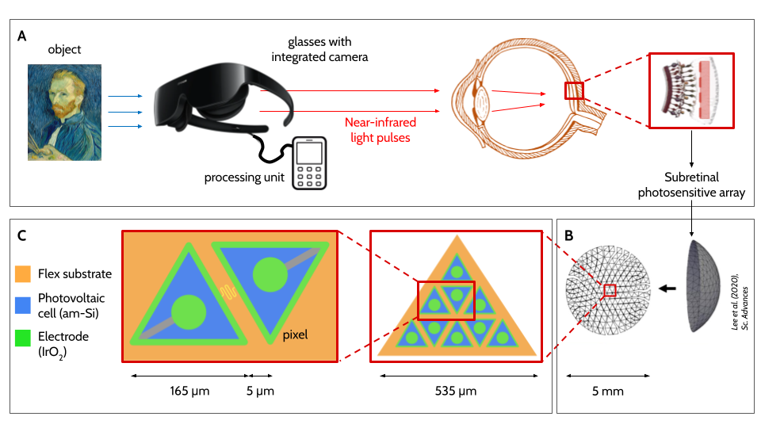

# ReTRIna
A flexible retinal implant.

This project was part of the Flexible Biolectronics course, @2021 EPFL.  
Contributors to the project:  
- Tobias Bodenmann
- Bastien Darbellay
- Lukas C. van den Heuvel
- Raphael Kohler

The ReTRIna system is composed of three elements: glasses with an integrated CCD camera, a pocket processing unit, and a flexible photosensitive array implanted beneath the retina.



**Overview of ReTRIna device. [A]** Macroscopic view. **[B]** Computational wrapping. **[C]** Microscopic view of electrode array.

Scripts in this repository:
- ```NeutralPlane.m```: Calculations of strain and stress in the ReTRIna device and position of the neutral plane (supports **Bending Mechanics** section in report).
- ```SimulationStrategy.m```: Calculation of circuit constants and overall dimensions in the ReTRIna device (supports **Simulation Strategy** and **Shunt Resistor** sections in report).
- ```LTSpice/ReTRInaModel.asc```: LTSpice model to simulate the injected current (supports **Simulation Strategy** and **Shunt Resistor** sections in report).
- ```LTSpice/PlotLTSiceModel.m```: Plot simulation results.
- ```PhotovoltaicCellSize.mlx```: Calculates the size of the photovoltaic cell needed to produce the necessary current (supports **Appendix D** of report).
